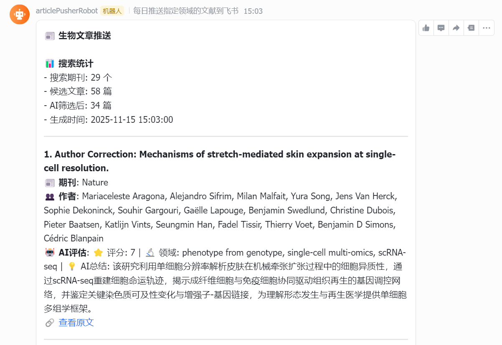

# BioArticlePusher

生物文章推送系统 - 智能搜索、AI过滤和飞书推送

[](https://www.python.org/)
[](LICENSE)

## 简介

一个智能的生物文章搜索、AI过滤和飞书推送系统。支持从PubMed和BioRxiv自动搜索最新生物文章，使用AI模型评估文章相关性，并推送筛选结果到飞书群聊。

## 安装

```bash
pip install BioArticlePusher
```

或从源码安装：

```bash
git clone https://github.com/ykongxiang/BioArticlePusher.git
cd BioArticlePusher
pip install -e .
```

## 快速开始

### 方法1：使用Python函数创建配置文件

```python
from pusher import create_config_template, create_secrets_template

# 创建配置文件模板
config_path = create_config_template("article_search_config.yaml")
secrets_path = create_secrets_template("secrets.yaml")

print(f"配置文件已创建: {config_path}")
print(f"密钥文件已创建: {secrets_path}")
```

### 方法2：手动创建配置文件

1. 复制配置文件模板：
```bash
cp secrets.yaml.template secrets.yaml
cp article_search_config.yaml.example article_search_config.yaml  # 如果存在
```

2. 编辑 `secrets.yaml`，填入API密钥：
```yaml
ai:
  kimi:
    api_key: "YOUR_KIMI_API_KEY_HERE"
    base_url: "https://api.moonshot.cn/v1"

feishu:
  webhook_url: "YOUR_FEISHU_WEBHOOK_URL_HERE"
```

3. 运行：
```bash
bioarticle-pusher
```

### 使用自定义配置文件

```python
from pusher import ArticleSearcher

# 指定自定义配置文件路径
searcher = ArticleSearcher(
    config_file="my_config.yaml",
    secrets_file="my_secrets.yaml"
)

# 搜索文章
results = searcher.search_articles(days=7)
```

## 配置参数说明

### 搜索配置 (article_search_config.yaml)

#### search_config
- `days`: 搜索最近几天的文章（默认：7）
- `max_results_per_journal`: 每个期刊最大结果数（默认：20）

#### journals
- `pubmed_journals`: PubMed期刊列表，可添加或删除期刊
- `biorxiv.enabled`: 是否启用BioRxiv搜索（true/false）
- `biorxiv.subjects`: BioRxiv主题列表，如：bioinformatics, computational_biology, genomics

#### keywords
- `any`: 任意匹配的关键词列表（文章包含任一关键词即可）
- `all`: 必须全部包含的关键词列表（文章必须包含所有关键词）

#### authors
作者过滤配置，用于筛选特定作者的文章。

- `mode`: 过滤模式
  - `"biorxiv_only"`: 仅对BioRxiv文章进行作者过滤，PubMed文章不受影响
  - `"all"`: 对所有来源的文章（包括PubMed和BioRxiv）进行作者过滤
  
- `include`: 包含的作者列表
  - 只保留包含这些作者的文章
  - 支持部分匹配，例如配置 `"Fabian Theis"` 可以匹配 `"Fabian J. Theis"`
  - 作者姓名必须完全匹配（不区分大小写）
  - 示例：
    ```yaml
    include:
      - "Fabian Theis"
      - "David Baker"
      - "Aviv Regev"
    ```
  
- `exclude`: 排除的作者列表
  - 排除包含这些作者的文章
  - 支持部分匹配
  - 如果同时设置了 `include` 和 `exclude`，先应用 `include` 过滤，再应用 `exclude` 过滤
  - 示例：
    ```yaml
    exclude:
      - "Author Name"
    ```

**使用示例：**
```yaml
authors:
  mode: "biorxiv_only"  # 只过滤BioRxiv文章
  include:
    - "Fabian Theis"
    - "David Baker"
  exclude: []  # 不排除任何作者
```

**注意事项：**
- 如果 `include` 列表为空，则不会进行包含过滤（所有文章都保留）
- 如果 `mode` 为 `"biorxiv_only"`，PubMed文章不会受到作者过滤影响
- 如果文章没有作者信息，在 `mode: "all"` 且有 `exclude` 列表时，文章会被保留；否则会被过滤掉

#### ai_filtering
AI过滤配置，用于使用AI模型评估文章相关性。

**基本配置：**
- `enabled`: 是否启用AI过滤（true/false）
- `demo_mode`: 演示模式，无需API key（true/false）
- `language`: AI描述语言设置（`"zh"` 中文，`"en"` 英文，默认：`"zh"`）
  - 影响AI生成的description字段的语言
  - 需要在提示词中使用 `{language}` 占位符
- `max_articles_for_filtering`: 最大检索上限，控制交给AI过滤的文章数量（默认：100，0表示无限制）
  - 当检索到的文章数量超过此上限时，只对前N篇文章进行AI过滤
  - 可以有效控制AI过滤的处理时间，避免处理过多文章导致脚本运行时间过长
  - 示例：设置为 `10` 时，即使检索到209篇文章，也只会对前10篇进行AI过滤
- `model.provider`: 模型提供商（kimi, deepseek, openai）
- `model.name`: 模型名称
- `model.api_key`: API密钥（从secrets.yaml引用：`${secrets.ai.kimi.api_key}`）
- `model.base_url`: API基础URL（从secrets.yaml引用：`${secrets.ai.kimi.base_url}`）
- `model.temperature`: 模型温度参数（0.0-1.0，默认：0.1）
- `model.max_tokens`: 最大生成token数（默认：1000）
- `prompt`: AI过滤提示词，可自定义评估标准（可使用 `{language}` 占位符）

**最大检索上限使用示例：**
```yaml
ai_filtering:
  enabled: true
  max_articles_for_filtering: 50  # 最多处理50篇文章
  # 设置为 0 表示无限制，处理所有检索到的文章
  # 设置为 10 可以快速测试，只处理前10篇文章
```

**支持的AI提供商：**

1. **Kimi (Moonshot)**
   ```yaml
   ai_filtering:
     model:
       provider: "kimi"
       name: "kimi-k2-0905-preview"
       api_key: "${secrets.ai.kimi.api_key}"
       base_url: "https://api.moonshot.cn/v1"
   ```
   在 `secrets.yaml` 中配置：
   ```yaml
   ai:
     kimi:
       api_key: "YOUR_KIMI_API_KEY"
       base_url: "https://api.moonshot.cn/v1"
   ```

2. **DeepSeek**
   ```yaml
   ai_filtering:
     model:
       provider: "deepseek"
       name: "deepseek-chat"
       api_key: "${secrets.ai.deepseek.api_key}"
       base_url: "https://api.deepseek.com"
   ```
   在 `secrets.yaml` 中配置：
   ```yaml
   ai:
     deepseek:
       api_key: "YOUR_DEEPSEEK_API_KEY"
       base_url: "https://api.deepseek.com"
   ```

3. **OpenAI**
   ```yaml
   ai_filtering:
     model:
       provider: "openai"
       name: "gpt-4"
       api_key: "${secrets.ai.openai.api_key}"
       base_url: "https://api.openai.com/v1"
   ```
   在 `secrets.yaml` 中配置：
   ```yaml
   ai:
     openai:
       api_key: "YOUR_OPENAI_API_KEY"
       base_url: "https://api.openai.com/v1"
   ```

**添加新的AI提供商（无需修改代码）：**

系统使用**通用API调用方法**，自动适配所有支持OpenAI兼容API格式的AI提供商。

✅ **无需修改代码** - 只需在配置文件中指定新的提供商即可

**使用步骤：**

1. 在 `secrets.yaml` 中添加新提供商的配置：
   ```yaml
   ai:
     your_provider:  # 例如：claude, gemini, qwen等
       api_key: "YOUR_API_KEY"
       base_url: "https://api.yourprovider.com/v1"
   ```

2. 在 `article_search_config.yaml` 中配置：
   ```yaml
   ai_filtering:
     model:
       provider: "your_provider"  # 使用新的提供商名称
       name: "your-model-name"    # 模型名称
       api_key: "${secrets.ai.your_provider.api_key}"
       base_url: "${secrets.ai.your_provider.base_url}"
       temperature: 0.1
       max_tokens: 1000
   ```

3. 完成！系统会自动使用新提供商。

**API格式要求：**
- 支持 `/chat/completions` 端点
- 使用 `Bearer` token认证（`Authorization: Bearer {api_key}`）
- 请求格式与OpenAI兼容
- 响应格式包含 `choices[0].message.content` 字段
- 响应内容为有效的JSON格式

**注意事项：**
- 如果API不支持 `response_format: {"type": "json_object"}`，系统仍会尝试解析响应，但需要在提示词中明确要求返回JSON格式
- `demo_mode` 模式可用于测试，无需真实的API密钥
- 建议先在演示模式下测试配置，确认无误后再使用真实API

#### feishu
- `enabled`: 是否启用飞书推送（true/false）
- `webhook_url`: 飞书机器人Webhook URL（从secrets.yaml引用：`${secrets.feishu.webhook_url}`）
- `push_config.max_articles_per_push`: 每次推送的最大文章数（默认：10）
- `push_config.include_abstract`: 是否推送文章摘要（true/false）
- `push_config.abstract_max_length`: 摘要最大长度（默认：200）
- `push_config.include_ai_evaluation`: 是否推送AI评估结果（true/false）
- `push_config.language`: 推送语言设置（`"zh"` 中文，`"en"` 英文，默认：`"zh"`）
  - 影响推送消息的标签语言（如"期刊"→"Journal"、"作者"→"Authors"等）
  - 影响AI评估描述的语言（AI生成的description字段）
- `push_config.template`: 推送消息模板，可自定义格式

**语言设置示例：**

设置AI描述为英文，推送消息为中文：
```yaml
ai_filtering:
  language: "en"  # AI描述使用英文

feishu:
  push_config:
    language: "zh"  # 推送标签使用中文
```

设置全部为英文：
```yaml
ai_filtering:
  language: "en"

feishu:
  push_config:
    language: "en"
```

#### output
- `filename_format`: 输出文件名格式，支持 `{days}` 占位符（默认：`"search_results_{days}days.json"`）
- `show_details`: 是否显示详细信息（true/false）
- `abstract_max_length`: 摘要长度限制，-1表示不限制（默认：-1）

## 命令行使用

### Python 命令行工具

```bash
# 搜索最近7天的文章并推送
bioarticle-pusher

# 搜索最近3天的文章
bioarticle-pusher --days 3

# 使用自定义配置文件
bioarticle-pusher --config my_config.yaml --secrets my_secrets.yaml

# 只搜索，不推送
bioarticle-pusher --no-push
```

### Shell 脚本使用（推荐用于定时任务）

项目提供了 `article_pusher.sh` 脚本，整合了文章搜索、cron任务管理和日志查看功能。

#### 基本用法

```bash
# 1. 执行文章搜索（默认）
./article_pusher.sh
# 或
./article_pusher.sh run

# 2. 快速设置每天3点的cron任务
./article_pusher.sh setup-cron

# 3. 进入cron任务管理菜单
./article_pusher.sh manage

# 4. 查看帮助
./article_pusher.sh help
```

#### 自定义配置

编辑脚本顶部的配置区域：

```bash
# Conda 环境名称
CONDA_ENV_NAME="bioinfopusher"

# 配置文件路径
YAML_PATH="article_search_config.yaml"
SECRET_PATH="root/secret.yaml"

# 调试模式（通过环境变量 DEBUG=1 启用）
DEBUG=${DEBUG:-0}
```

#### 调试模式

启用调试模式查看详细信息：

```bash
DEBUG=1 ./article_pusher.sh
```

#### Cron 任务管理

进入管理菜单后，可以：
1. 查看当前 cron 任务
2. 设置新的执行时间（支持自定义 cron 表达式）
3. 删除 cron 任务
4. 测试执行脚本（立即运行）
5. 查看日志文件
6. 退出

#### 定时执行示例

```bash
# 设置每天凌晨3点自动执行
./article_pusher.sh setup-cron

# 或使用管理菜单设置自定义时间
./article_pusher.sh manage
# 然后选择选项2，输入cron表达式，例如：
# 0 18 * * *  # 每天18点执行
# 0 */6 * * *  # 每6小时执行一次
```

#### 日志文件

日志文件保存在 `logs/` 目录下，按日期命名：
- `bioinfo_search_YYYYMMDD.log`

#### 注意事项

- 确保脚本有执行权限：`chmod +x article_pusher.sh`
- 确保 conda 环境已正确配置
- 确保配置文件 `article_search_config.yaml` 存在
- 脚本会自动检测并激活指定的 conda 环境

## Python API

```python
from pusher import ArticleSearcher

# 初始化搜索器
searcher = ArticleSearcher()

# 搜索文章
results = searcher.search_articles(days=7)

# AI过滤
filtered_results = searcher.filter_with_ai(results)

# 推送到飞书
searcher.push_to_feishu(results, filtered_results, days=7)

# 保存结果
searcher.save_results(filtered_results, days=7)

# 完整工作流程
final_results = searcher.run_complete_workflow(days=7)
```

## 许可证

本项目采用 MIT 许可证 - 查看 [LICENSE](LICENSE) 文件了解详情。
